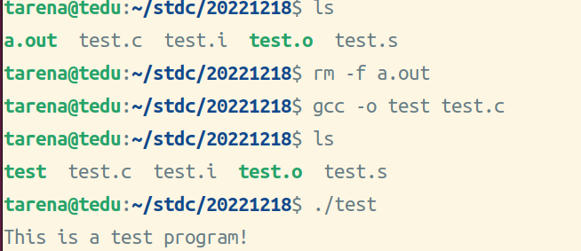
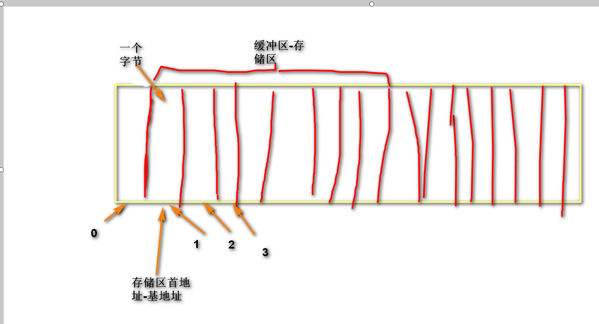
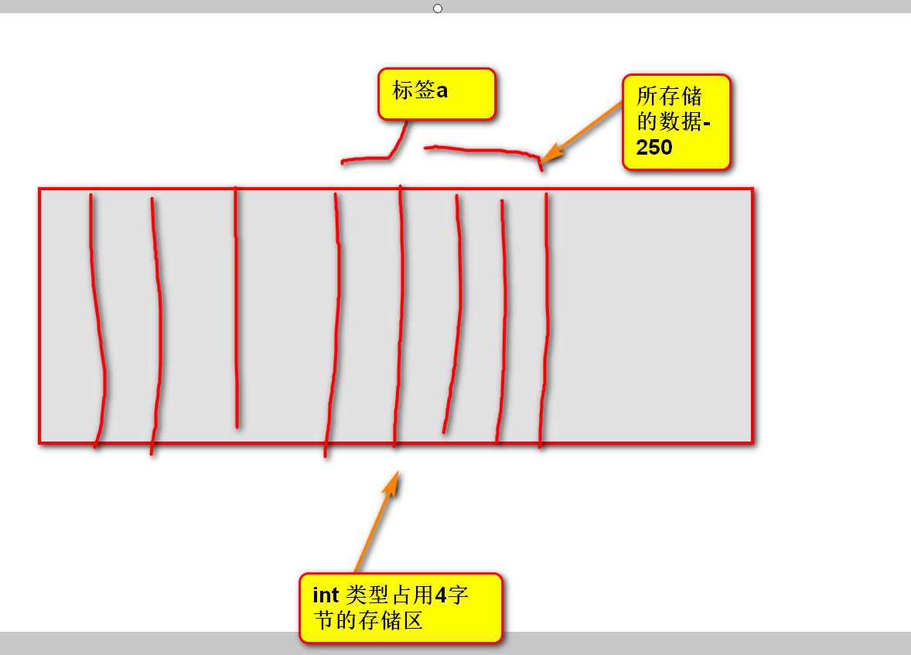
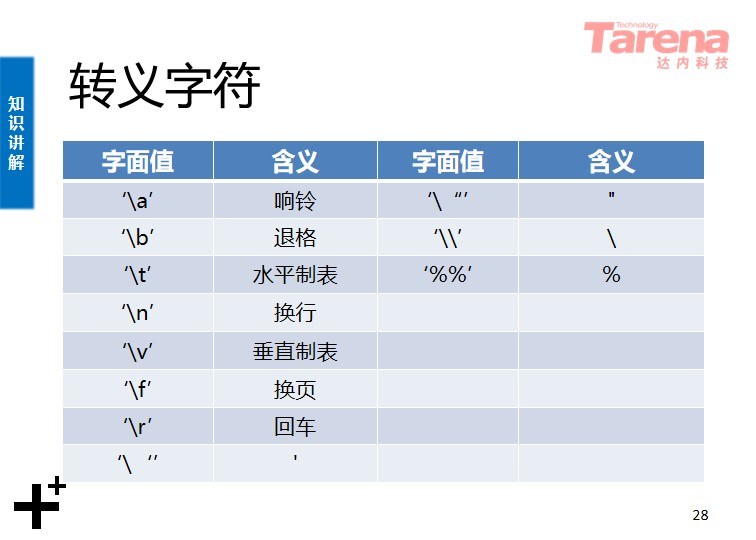
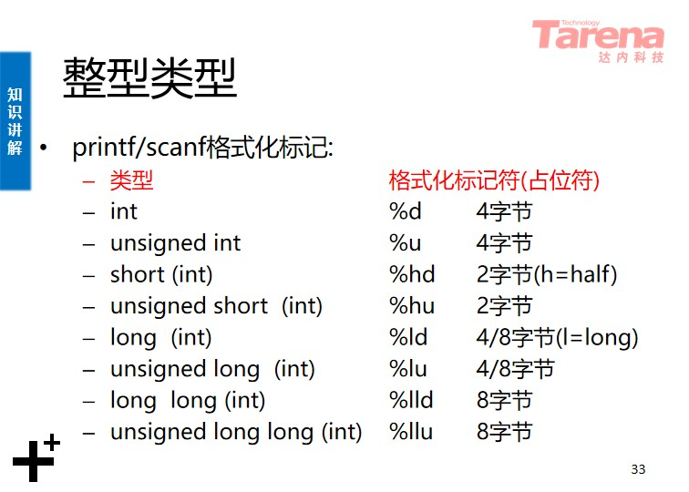
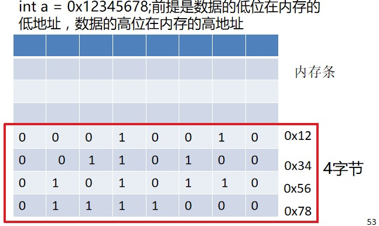

# C语言

## 001 编程基础

### 1.1 C语言的历史背景

### 1.2  ==C语言程序的开发步骤==

#### 1.2.1 编辑源代码

#### 1.2.2 ==编译==预处理

#### 1.2.3 将源预处理的结果==编译==为汇编代码（gcc test.c）

#### 1.2.4 将汇编代码==汇编==为目标模块

#### 1.2.5  将目标模块和库==链接==为可执行程序

#### 1.2.6 将可执行程序==加载==到内存形成进程映像（./a.out）

#### 1.2.7 处理器==执行==进程映像中指令（main函数开始运行）

### 1.3 C程序文件类型

源文件(.c后缀名)：必须有

```
hello.c
```

头文件(.h后缀名)：可以有可以没有

```
stdio.h
```

### 1.4 C语言的注释风格

1.4.1 说明：注释：程序的说明信息，不参与编译和运行（后面学习gcc的编译过程中有所体现）

#### 1.4.2 不同的注释方法

##### 1.4.2.1 多行注释

```c
/*这里面可以输入想要注释的内容，可以进行换行，没有具体的行数限制，当时不能够进行嵌套（比如中间再添加多行注释）
*/
```

##### 1.4.2.2 单行注释

```c
// 这里面可以输入想要注释的内容，无法进行换行（即只在当前行起作用,此处多行的注释效果只是显示效果。），但是可以进行嵌套比如添加多个斜杠进行// 同样不会出现报错
```

### 1.5  # include指令

说明：头文件包含指令

作用：在预处理阶段会将头文件进行拷贝替换。

#### 1.5.1 ==使用语法==

##### 1.5.1.1 使用尖括号 - #include <xxx.h>

```
可以在编译时指定所要查找指令的目录
-gcc -I /home/tarena/include hello.c
表示 首先到-I选项后面的指定目录中查找，随后再去系统目录中查找。
```

##### 1.5.1.2  使用英文双引号 - #include "xxx.h"

```
同样也可以通过添加-I选项，指定查找指令目录的方式。
其与尖括号的查找范围不同，添加-I选项后，先到-I指定目录中查找，再到当前目录，最后查找系统目录。
```

补充：头文件的系统目录

```
- /usr/include 
- /usr/local/include
- /usr/lib/gcc/i686-linux-gnu/4.6.3/include
```

### 1.6  主函数main原型（必须有，唯一）

#### 1.6.1 说明：

任何C语言程序必须有一个main函数

程序必须从main函数开始依次向下进行执行


#### 1.6.2 补充

遇到return程序立刻结束，后面跟0或者非零

### 1.7 ==GCC编译器==

作用： 翻译官将源文件、头文件翻译生成可执行文件

```
- hello.c, stdio.h --> a.out
- 对应的命令：gcc 
```

#### 1.7.1 GCC 编译器的常用选项

9字真言：预处理-编译-汇编-链接库

##### 1.7.1.1  -o：指定输出文件路径 gcc 路径 -0 helloworld ..

##### 1.7.1.2 -E: 编译==预处理==-拷贝头文件

```
gcc -E hello.c -o hello.i
hello.i 就是预处理文件
```

##### 1.7.1.3 -S: ==编译==产生汇编文件

```
gcc -S hello.i -o hello.s
hello.s就是汇编文件
```

##### 1.7.1.4 -C：==汇编==产生目标模块

```
gcc -c hello.s -o hello.o 
hello.o 就是目标文件
```

##### 1.7.1.5 -l(小写L): 指定==链接==库

```
gcc hello.o -o hello -lc
hello为最终的可执行程序
```

#### 1.7.2 小结- C程序编译方法

##### 1.7.2.1 直接生成a.out可执行程序

```
-gcc hello.c
```

##### 1.7.2.2 ==分步法==

###### first:首先进行预处理文件

说明：生成后缀名为.i的预处理文件

###### second: 将预处理文件翻译成汇编文件

说明：生成后缀名为.s的汇编文件

###### third: 将汇编文件翻译生成目标文件

说明：生成后缀名为.o的目标文件

###### fourth: 链接-将其中的printf函数代码包含生成可执行程序

（链接库这步，我不知道为什么我老是报错）

##### 1.7.2.3  一步到位法

```
- gcc -o helloworld helloworld.c 
```



### 1.8 变量相关概念

#### 1.8.1 内存RAM

内存条，临时存储程序，断电后失去所有数据



#### 1.8.2 字节（Byte）= 8 bit

计算机将内存分成一格一格，每一格用来存储一个数字，每一格对应的专业术语叫字节。

#### 1.8.3  地址（Address）

计算机给内存中的每个字节都指定一个唯一的编号，编号从0开始，后续字节编号一次加1.

#### 1.8.4 存储区（Buffer）

计算机将1字节或者多个连续的字节形成的存储单元简称存储区，又称缓冲区。

#### 1.8.5 首地址（Base Address）

又称起始地址，存储区中第一个字节的地址用来当做存储区的首地址，又称基地址。

原则：任何程序访问内存前先要由操作系统负责进行分配地址。

### 1.9 常量

概念：在程序执行郭晨中，其值不发生改变的量称之为常量

#### 1.9.1 常量的类型：

直接常量

```
整型量： 10,10U，10L，012， 0xA
实型量：0.12， 0.12F, 1.2E-1
字符常量：'A','\n'
字符串： "Hello,World!\n"
```

标识符

```
标识变量名、数组名、函数名、类型名的有效字符序列
```

符号常量

```
符号化的常量，比如宏定义、枚举元素等
```

### 1.10 变量

说明：在程序执行过程中，其值可以发生改变的量称为变量

定义变量（分配内存）语法：数据类型 变量名 = 初始值

```c
int a = 520;
// 表面：定义整型类型变量a并且将a的值初始化为520
// 本质：分配4字节（int类型所占内存大小）并且存储520，此存储区的标签为a
```

内存图

补充：合法标识符的命名规范

```
1. 以字母或者下划线开头，不能以数字开头
2. 只能由数字、字母和下划线组成
3. 不能与C语言自带的关键字有冲突
4. 标识符对大小写敏感-即区分大小写
```

### 1.11 C语言的编程风格

单条语句可写在任意多行内

```c
int main(void){printf("Today is a good day\n");return 0;}
```

必要的==空格==会使得代码更加清晰

严格的==缩进==令代码层次分明

适度的==空行==划分出逻辑单元

统一用==驼峰==或者==下划线==进行命名

```
int nAge = 19; // 驼峰
int CreateWindows = 520; // 大驼峰、双峰
int my_age = 24; // 下划线命名
```

### 1.12  两个常用标准C库函数

#### 1.12.1 printf()

#### 1.12.2 scanf()

### 1.13 基本数据类型

### 1.14 sizeof关键字

#### 作用：sizeof(参数)

```
1.计算内存的大小， 以字节为单位
2.参数可以是类型、变量或者表达式
3.不计算参数的值，只关注其类型 sizeof(1+1)
4.如果传递的参数是赋值语句，则无效 - sizeof(a = 520);
```


## 002  基本数据类型之字符类型

### 2.1 字符常量

#### 2.1.1 说明：

- 使用单引号括起来进行表示 - ‘A’

- 本质内存存储的是一个整数， 即字符的ACSdII码

- 详情可见ascii编码表

### 2.2 字符变量 - char类型(开辟的内存为一个字节大小)

- （signed）char / unsigned char  
- printf/scanf 格式化占位符：%c、%hhd(half half d)

#### 2.2.1常用可显示字符 - 对应ASCII码值

- 空格 - 32
- 数字【0-9】 -  48-57
- 大写字母 -  65-90
- 小写字母 -  97-122

### 2.3 转义字符 

直接插个图片吧，忘了的时候就过来翻翻就行

### 2.4 练习时间

#### 2.4.1 把数字字符转换为整数：‘5’-5

```c
#include <stdio.h>
int main()
{
	char str_number, number;
	printf("请键入一个数字字符，将其转化为数字：\n");
	scanf("%c", &str_number);
	number = str_number - '0';
	printf("输入的字符为%c,转化为数字%hhd\n", str_number, number);
	
	
	return 0;
}
```


#### 2.4.2 把小写字母转换为大写字母： ‘a’ - 'A'

```c
#include <stdio.h>
int main(void){
	
	char lower_letter, upper_letter;
	printf("请输入一个小写字母，本程序会将其转换为大写字母：");
	scanf("%c", &lower_letter);
	
	upper_letter = lower_letter - ('a' - 'A');
	printf("输入的字母为%c, 转换后的大写字母为%c\n", lower_letter , upper_letter);
	
	
	return 0;
}
```

## 003 基本数据类型之整型类型

### 3.1  整型 

- short / int / long / long long 

#### 3.1.1 有符号数(signed)

#### 3.1.2 无符号数(unsigned)

### 3.2 整型类型格式化标记符（占位符）

- 补充：long 类型在32位、64位系统下所占字节分别为4/8字节。

#### 3.2.1 整型字面值前缀

- 无：十进制 - 520
- 0：八进制 - 0520
- 0x: 十六进制 - 0xAD

#### 3.2.2  整型字面值后缀

- 无：int，100， sizeof(100) - 4
- U/u: unsighed int - 100U、100u
- L/l : long, - 100L、100l
- LL/ ll : long long - 100LL 、100ll
- UL/ ul: unsigned long  - 100UL、 100ul

## 004  基本数据类型之浮点类型

### 4.1 格式化标记

#### 4.1.1 float类型

- %f : 后面补充零
- %g: 后面没有零，只显示非零数字

#### 4.1.2 double类型

- %lf 
- %lg

### 4.2 字面值后缀

- 无：double类型 - 1.23
- F/f：float类型 - 1.23F、1.23f

==练习时间==：用户输入圆的半径-计算圆的周长和面积

```c
#include <stdio.h>
int main()
{
	double r;
	printf("请输入一个圆的半径（本程序会计算圆的周长和半径）：");
	scanf("%lg", &r);
	
	printf("半径为%lg的圆的半径的周长为%lg\n", r,3.14 *2 * r);
	printf("半径为%lg的圆的半径的面积为%lg\n", r,3.14 * r* r);
	
	
	return 0;
}
```

### gcc编译补充

```c
//将程序警告（warning）变成错误
gcc -o test test.c -Werror
```

```c
#include<stdio.h>
int main()
{
	int a = 50;
	printf("a = %d\n",a);
	printf("a = %ld\n",a);
	
	long b = 50;
	
	printf("b = %ld\n", b);
	printf("b = %d\n", b);
	
	// 使用sizeof运算符，展示整型数后缀值的作用
	printf("%d\n", sizeof(520));
	printf("%ld\n", sizeof(520L));
	
	return 0;
}
```

## 005 ==进制转换与运算符==

### 5.1 整数的二、八、十六进制与十进制的转换（相互转换）

#### 5.1.01 二进制的相关概念

- 二进制：用一组0和1表示数字的方法简称二进制表示形式

  ```c
  unsigned char = 7;  // 二进制表示 01010101
  ```

- 数据不同的表现形式

  ```
  1. 数据在内存硬件上以二进制形式存储
  2. 数据在软件上以十进制，八进制、十六进制表示（如果是满屏的01估计人都要疯了吧）
  ```

- 位（bit/bit位）- 简写 b

  ```c
  /*
  1. 位只能 表示0、1
  2. 1 Byte = 8 bit
  */
  short a = 520; // short 类型2字节，即16个bit位
  ```

- 二进制特点

  ```
  /*
  1. 二进制数每个bit位的编号从左到右，编号（位权）从0开始，由低位到高位
  2. 二进制数逢二进一
  3. 二进制数中每个1单独代表一个十进制数，这个十进制数是2的位权次方
  */
  ```

- 二进制的符号位

  ```
  有符号类型的数字（不加unsigned修饰）表示有符号数，二进制数最左边的位为符号位。
  符号位为0表示为非负数
  符号位为1表示为负数
  例如 0110 1111 - 前提是char类型 正数 - 111
  	1110 1111 - 前提是char类型 负数 - （-17）
  ```

  

#### 5.1.02 二进制与十进制之间的转换（非负）

##### （1） 二进制转十进制 - 位权相加法

```c
// 0000 1111
// 2^0 + 2^1 + 2^2 + 2^3 = 15
```

##### （2）十进制转二进制 - 辗转相除，逆序排序

```c
/*
十进制：15
15/2 = 7 ... 1
7/2 = 3 ... 1
3/2 = 1 ... 1
1/2 = 0 ... 1
*/
// 逆序排列 ： 0000 1111 (低位顺写，高位补0)
```

补充：在定义数据类型的时候要十分注意，如果数据类型给的小了，那就会造成数据丢失（在内存中所有数据都是以二进制形式体现的）

#### 5.1.03 二进制与十进制之间的转换（负数）

###### （1）二进制转十进制 - 取反加一，转十添负

```c
/*
char
1010 1010 --> 取反 --> 01010101 --> +1 --> 01010110 --> 转十 --> 64 + 16 + 4 + 2 = 86 --> 添负 --> -86
*/
```

方法二：char类型的负数符号位为（-128）加上其他位数的十进制数，就是最后的十进制数

###### （2）十进制转二进制 - 取负转二，取反加一

```c
// -15 : 15 --转二进制--> 0000 1111 --取反--> 1111 0000 --加1--> 1111 0001
```

#### 5.1.04 二进制和八进制之间的转化

##### （1）八进制的概念：满8进一（0-7）; 数值前缀加0；printf/scanf格式符使用 - %[#]0

##### （2）转换：从右到左 每三位分为一组，每组用0-7的数字替换得到8进制形式 类似于linux chmod命令的数字模式

```c
/*
0000 1111 -- 三位1组--> 017
*/
```

#### 5.1.05 二级制和十六进制之间的转换（==核心==）

##### (1)十六进制的概念:

- 满16进1；
- 显示十六进制数字前加X/x;
- printf/scanf 格式符使用 - %[#]x / X

##### (2) 转换：从右到左 每四位为一组，对应一位十六进制，每组使用0-9 A-F 进行替换

```
/*
0111 1111  --四位一组--> x7f
*/
```

在实际开发中使用电脑自带的计算器可以进行上述计算

```
HEX：16进制
DEC：8进制
OCT ： 10进制
BIN ：2进制
BYTE：1字节
WORD：2字节
DWORD：4字节
QWORD:8字节
```

##### 思考  - 将下列二进制转化为十六进制 

```
0101 1101;
0110 1101;
1010 0011; 
1001 0011 ;
1111 1111 0100 0001;
```

### 5.2  *数据的二进制存储形式*

#### 5.2.1 int data  = 0x12345678; - 内存中的存储形式-==绘制内存图==



### 5.3 运算符 

#### 5.3.1 赋值运算符

- 把右边的值赋给左边的变量，赋值从右向左算

  ```c
  int h,j,k,l;
  h = j = k = l = 0;
  ```

- 赋值运算符的左边必须是一个左值（变量），不能是一个常数或是表达式。

- 复合赋值符 - 赋值运算符可以与其他运算符结合使用

  ```c
  int i = 0；
  i += 1；// i = i+1
  ```

- *=*代表赋值， *==*代表相等（在逻辑判断中经常使用）

- 演示代码

  ```c
  //赋值运算符演示:=
  #include <stdio.h>
  int main(void) {
      int a, b, c;
      a = 100;
      printf("a = %d\n", a);
      a = b = c = 200; //c = 200, b = c, a = b; //不推荐
      printf("%d, %d, %d\n", a, b, c);
      /*200 = a; //gcc报错
      a + b = c; //gcc报错
      (a = b) = 300; //gcc先算圆括号里面的内容,而圆括号是一个表达式
      */
      a += b; //等价于:a = a + b;
      printf("a = %d, b = %d\n", a, b);
      a -= b; //等价于:a = a - b;
      printf("a = %d, b = %d\n", a, b);
      a *= b; //等价于:a = a * b;
      printf("a = %d, b = %d\n", a, b);
      a /= b; //等价于:a = a / b;
      printf("a = %d, b = %d\n", a, b);
      return 0;
  }
  ```

  

#### 5.3.2 算数运算符

- +、- 、*

- / 在C语言中比较特殊 - 如果是整数相除，则会直接丢弃掉小数部分，结果只保留整数部分

- 求模（取余）- % 

  ```
  被除数为0， % 和 / 运算符都会导致程序中断
   / 0.0,会得到无穷大 inf
   % 只能用于整数，浮点数不支持
   %的正负号，与%前面数字的正负号相同
  ```

- 代码演示

  ```c
  // 算数运算符中 / 和 % 运算符的演示
  #include <stdio.h>
  int main(){
  	int number_a = 5, number_b = 2;
  	// 除法运算符
  	printf("number_a / number_b = %g\n", number_a / number_b);  // / 直接丢弃小数部分
  	
  	// 避免出现上述问题
  	float number_c = 2.0;
  	printf("number_a / number_c = %g\n", number_a / number_c);  // 数值类型自动转换为取值范围更大的来进行计算
  	
  	// 求模运算符 - %
  	// printf("number_a % 0.0 = %g\n", number_a % 0);  在gcc中会得到inf(无穷大的值) - devC++程序直接中断了，后续的代码也没有执行。
  	int number_d = 4;
  	
  	printf("number_d % 2 = %d\n", number_d % 2);
  	return 0;
  }
  ```

- 练习时间 - 输入一个秒数，输出xx小时xx分xx秒

  ```c
  // 输入一个秒数，输出xx小时xx分xx秒
  #include <stdio.h>
  int main(void){
  	long seconds, hour, minute, second;
  	printf("请输入一个秒数（计算结果为xx小时xx分xx秒）:");
  	scanf("%ld", &seconds);
  	
  	hour = seconds / 3600;
  	minute = seconds % 3600 / 60;
  	second = seconds  % 60;
  	
  	printf("%ld秒转化结果为：%ld小时%ld分钟%ld秒\n", seconds, hour, minute, second);
  	
  	return 0;
  }
  ```

  

#### 5.3.3 *算数运算符 - 自增减运算*

- ++ / --，变量自增、自减1，不能用于常数
- 整型实型均可使用自增减运算符，但主要用于整型
- 前缀表达式 - ++i、--i ，先对变量进行自增减，后运算
- 后缀表达式 - i++、i-- ，先运算，后自增减
- i 、 i++和++i，从内存上来说是同一块内存区域
- <span style="color:red">i++、++i最好单独作为一个语句出现</span>>

##### （1）代码演示

```C
// 自增减运算符演示
#include<stdio.h>
int main(void)
{
	int a = 1;
	printf("a++之后的a = %d, a++= %d\n", a, a++);
	/*a++之后的a = 2, a++= 1 -
	  后缀运算符的a++表达式的值仍为变量a原本的值*/
	
	int b = 1;
	printf("--b之后的b= %d, --b= %d\n", b, --b);
	/*
	  --b之后的b= 0, --b= 0
	  前缀运算符的--b表达式的值为变量b自减后的值
	 */
	
	return 0;
}
```

#### 5.3.4 关系运算符

- 大于小于等于
- 关系表达式的值是<span style = "color:red;">真</span>或者<span style = "color:red;">假</span>，分别用1和0进行表示
- 不要进行练习的关系运算 - 5<4<3

#### 5.3.5 逻辑运算符 - 依靠真或假来进行判断（1/0）

- 与（&&）
- 或（||）
- 非（!）
- 短路与：一假为假
- 短路或：一真为真

#### 5.3.6 条件运算符和逗号运算

##### (1)条件运算符

- 语法：条件表达式？表达式1:表达式2；

- 说明：若条件表达式为真，则整个表达式的值取表达式1的值，否则取表达式2的值。

- 代码演示

  ```c
  // 条件运算符
  #include <stdio.h>
  int main()
  {
  	int a,b,c;
  	printf("请输入两个数字，比较两个数字之间的大小(暂时不考虑等于)：");
  	scanf("%d %d", &a,&b);
  	c = a >b ? a:b;
  	printf("你输入的第一个数字是%d,输入的第二个数字是%d,最大的数字为%d", a,b,c);
  	
  	return 0;
  }
  ```

  

##### (2) 逗号表达式

- 语法: 表达式1，表达式2，...表达式n

- 说明：依次计算各表达式的值，以表达式n的值作为整个表达式的值

- 并不是在所有出现逗号的地方都是逗号表达式

  ```c
  int a=2, b=3, c=4,x,y; // 不是逗号表达式
  ```

- 代码演示

  ```c
  //逗号运算符
  #include<stdio.h>
  int main(){
  	int a,b,z;
  	a = b = 2;
  	z = (a++,++b, a*b);
  	printf("最后的结果为%d\n",z);
  	
  	return 0;
  }
  ```

  